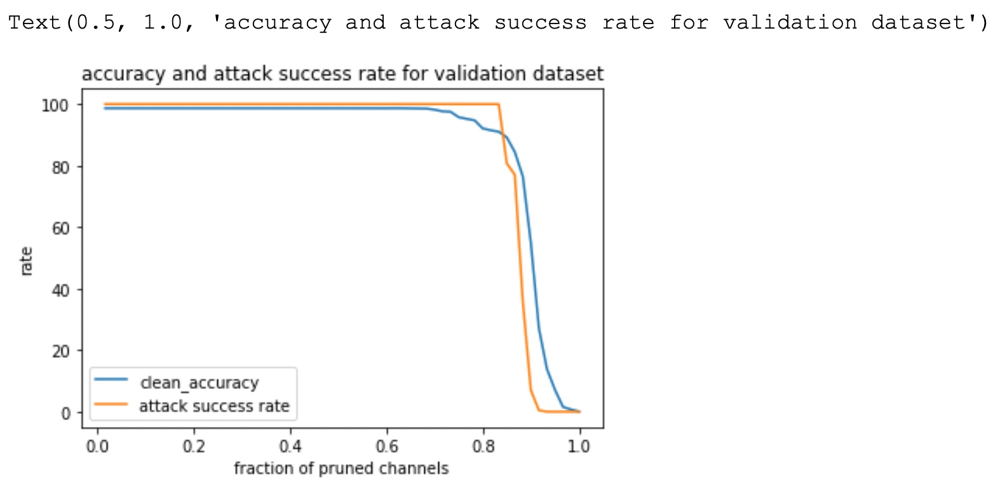

# ML-Cyber-Sec-Lab3

## Lab 3 Info

### Name: Venkata Naga Sai Kiran Challa
### Net ID: vc2118

We had to save the model when the accuracy drop was at  - 2%, 4% and 10% respectively.

For evaluation, in the notebook, run until cell 6 which calls `data_loader` and prints accuracy for clean data and continue till you finish the model's initialisation. Evaluate the Model section directly and run the code from that point

The attack success rate when the accuracy drops at least 30%:  6.954187234779596

From the graph below, we see that the pruning did not work because the attack success rate did not drop by a good margin.(I think it's because the attack is a prune aware attack)

Dataset: [here](https://drive.google.com/drive/folders/1NynKDQIAYi0r3tzbxLnmltj08gLp7qiz?usp=sharing)

